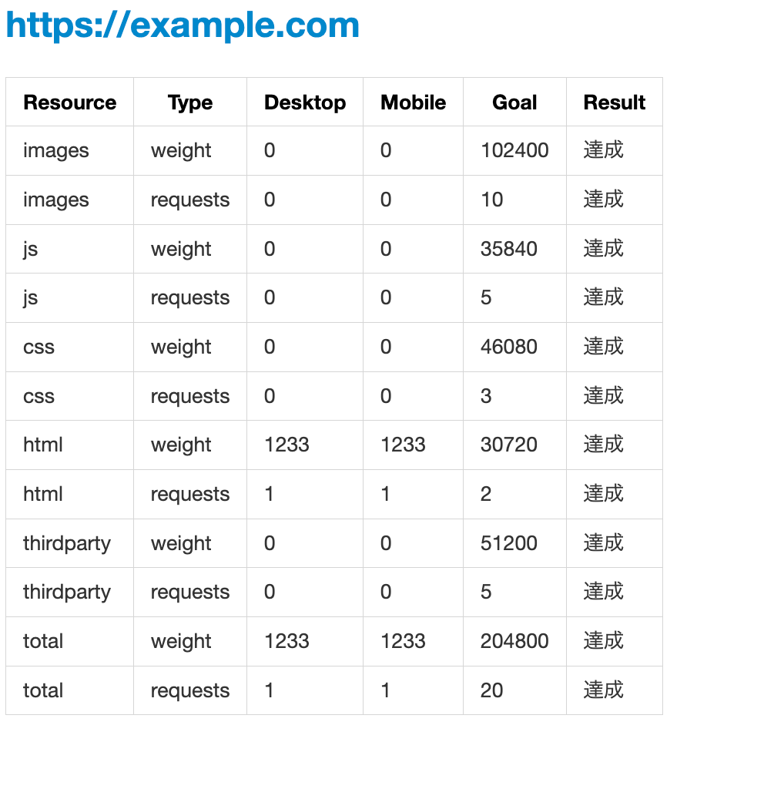
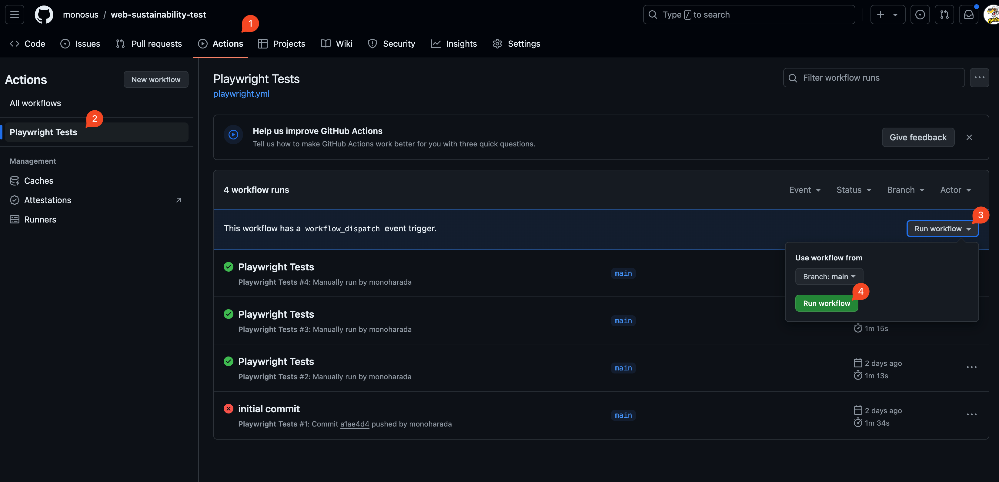

# web-sustainability-test

## 背景・目的

制作時、運用時かかわらずそのウェブサイトの持続可能性は重要な指標になってきます。
フロントエンド領域であれば、

- リソースのリクエスト回数
- リソースのダウンロードサイズ

を可能な限り小さく・少なくすることが重要です。局部局所でチューニングすることも有効ですが、  
定期的にウェブサイトのリソースがどうなっているかをチェックし、指標と照らし合わせることを簡易に取り組むために本リポジトリを有効活用してください。

## 使い方

手動または定期実行すると[report](./report/)内に`{実行日時}_report.md`が出力されます。マークダウンからPDFにするなりしてください。

### 出力イメージ


### 手動

1. **このリポジトリをforkします**
2. ウェブサイトのリソースに対する目標（指標）を[goals.ts](./goals.ts)に設定します
3. 対象となるURLを[urls.ts](./urls.ts)に配列形式で記載します
4. 2,3をリモートにプッシュした状態でGithubのActionsから`Playwright Tests`を実行します（下の図を参照）

上記4の解説


### 定期実行

[workflows/playwright.yml](./.github/workflows/playwright.yml)を修正し定期実行が可能です。
毎月１日か四半期毎の初月１日に実行できます。
コメントアウトされている

```yml
  #   - cron: '0 0 1 * *' # 毎月1日に実行
  #   - cron: '0 0 1 1,4,7,10 *' # 四半期ごとの1日に実行
```

の最初の`#`を削除してご利用ください。


## カスタムしたい

ローカルで調整してください。Bunとplaywrightを使用しています。

導入

```bash
bun install
```

```bash
bun init playwright@latest
```

テスト実行

```bash
bun run test
```


